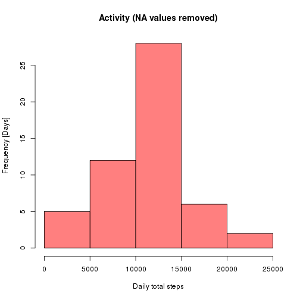

# Reproducible Research: Peer Assessment 1

This document represents the solution to the Peer Assignment 1 project for the 
Reproducible Research class.

The solution consists of a sequence of basic data processing tasks. The detailed 
description of the data set and the requirements for each processing step are
presented in the [instructions](https://github.com/onlineclass/RepData_PeerAssessment1/blob/master/original.repo.README.md) document.

In the implementation of this solution, I chose to use only the base plotting system


## Loading and preprocessing the data

Load the data and store it in the data frame object **activity**


```r
activity <- read.csv("activity.csv", stringsAsFactors = F)
```


## What is mean total number of steps taken per day?

Use **tapply** function to create an array of total number of steps for each day and 
then plot the daily activity histogram


```r
activity.daily <- tapply(activity$steps, activity$date, sum, simplify = T)
hist(activity.daily, main = "Activity (NA values removed)", xlab = "Daily total steps", 
    ylab = "Frequency [Days]", col = "#FF000080")
```

 


The mean and median values of the daily totla steps are simply computed using the **mean** and **median** functions applied to the **activity.daily** (the NA values will be removed - **na.rm = T**)


```r
activity.daily.median <- median(activity.daily, na.rm = T)
activity.daily.mean <- mean(activity.daily, na.rm = T)
```


```r
activity.daily.median
```

```
## [1] 10765
```


```r
activity.daily.mean
```

```
## [1] 10766
```


## What is the average daily activity pattern?

The following steps will create the timeseries plot of the average number of 
steps in each 5-minute interval: 
* remove all **NA** rows from the original data and store the filtered set in **activity.interval**.
* create a new data frame - **activity.interval.avg** - using the **tapply** with the **mean** function
* plot **mean_steps** column as a function of **interval**


```r
activity.interval <- activity[!is.na(activity$steps), ]

activity.interval.avg <- data.frame(interval = as.numeric(levels(as.factor(activity.interval$interval))), 
    mean_steps = tapply(activity.interval$steps, activity.interval$interval, 
        mean))

plot(activity.interval.avg$interval, activity.interval.avg$mean_steps, type = "l", 
    main = "5-minute interval - average steps", xlab = "interval", ylab = "average steps")
```

 


The maximum activity interval will be determined with the following statement:


```r
maximum.activity.interval <- activity.interval.avg[activity.interval.avg$mean_steps == 
    max(activity.interval.avg$mean_steps), 1]

maximum.activity.interval
```

```
## [1] 835
```


## Imputing missing values

Create a new data frame - **activity.na** - which is a subset of the original data (**activity**) and contains
all rows of the original data that contain missing values (**NA**)


```r
activity.na <- activity[rowSums(is.na(activity)) > 0, ]
```


The number of rows with missing data will be equal to the number of rows of the **activity.na** data object


```r
nrow(activity.na)
```

```
## [1] 2304
```


The strategy used to generate numerical values for the **activity.na$steps** is similar with the approach recommended in the assignment specifications - set the steps values in **activity.na** to the mean of all steps values for the same interval and same week day (Monday, Tuesday, etc) as those of the row in **activity.na**:
* create a new data object - **activity.interval.weekday** - by prepending a new column to the **activity.interval** data frame; the new column is generated by adding the day-of-week number (0,...,6) multiplied by 10000 to the interval value; i.e.: if the day is Monday (day of week = 1) and the interval is 835 (5 minute interval starting at 8:35am), the new value will be 10835
* compute the mean of the steps values for each distinct value of the new column (for each distinct pair of day-of-week and interval) across all days in **activity.int4erval.weekday**
* populate the **steps** column of activity.na with the same numerical value (made up from day-of-week and interval)
* merge the means data object with activity.na using the newly generated column (10000 * day-of-week + interval) for joining the two data frames
* replace the **steps** column in the new object with the value of the mean


```r
activity.interval.weekday <- cbind(10000 * as.POSIXlt(activity.interval$date)$wday + 
    activity.interval$interval, activity.interval)
names(activity.interval.weekday)[1] <- "weekday_int"

int.weekday.mean <- data.frame(weekday_int = as.numeric(levels(as.factor(activity.interval.weekday$weekday_int))), 
    mean.steps = tapply(activity.interval.weekday$steps, activity.interval.weekday$weekday_int, 
        mean))

activity.na$steps <- 10000 * as.POSIXlt(activity.na$date)$wday + activity.na$interval
activity.na <- merge(activity.na, int.weekday.mean, by.x = "steps", by.y = "weekday_int")
activity.na$steps <- as.integer(activity.na$mean.steps)
activity.na <- activity.na[, 1:3]
```


A new data set - **activity.new** - is created by appending the data set with synthesized values (**activity.na**) to the **activity.interval** data frame. :


```r
activity.new <- rbind(activity.interval, activity.na)
```


The histogram of the daily activity from the new data set and the mean and median of daily steps are computed using the following statements:


```r
activity.new.daily <- tapply(activity.new$steps, activity.new$date, sum, simplify = T)

hist(activity.new.daily, main = "Activity (synthesized replacements for NA)", 
    xlab = "Daily total steps", ylab = "Frequency [Days]", col = "#00FF2280")
```

 

```r
activity.new.daily.median <- median(activity.new.daily, na.rm = T)
activity.new.daily.mean <- mean(activity.new.daily, na.rm = T)
```


```r
activity.new.daily.median
```

```
## [1] 11015
```


```r
activity.new.daily.mean
```

```
## [1] 10810
```


## Are there differences in activity patterns between weekdays and weekends?

The last part of the analysis will create a list with two elements (data frames) which consist of the split of the **activity.new** data frame by the type of day - *weekday* or *weekend*


```r
activity.new <- cbind(as.POSIXlt(as.Date(activity.new$date))$wday, activity.new)
names(activity.new)[1] <- "day"

activity.new$day <- as.factor(ifelse((activity.new$day == 0 | activity.new$day == 
    6), "weekend", "weekday"))

## Define the function to be used by lapply()
compute.mean <- function(data) data.frame(interval = as.integer(levels(as.factor(data[, 
    4]))), mean_steps = tapply(data[, 2], data[, 4], mean))

activity.new.daytype <- lapply(split(activity.new, activity.new$day), compute.mean)
```


Each element of the list is used to create a time series graphic displayed in a 2-plot panel using the following statements:


```r
par(mfrow = c(2, 1))
plot((activity.new.daytype$weekend)$interval, (activity.new.daytype$weekend)$mean_steps, 
    type = "l", main = "Weekend 5-minute interval average steps", ylab = "average steps", 
    xlab = "interval")
plot((activity.new.daytype$weekday)$interval, (activity.new.daytype$weekday)$mean_steps, 
    type = "l", main = "Weekday 5-minute interval average steps", ylab = "average steps", 
    xlab = "interval")
```

 

```r
par(mfrow = c(1, 1))
```

